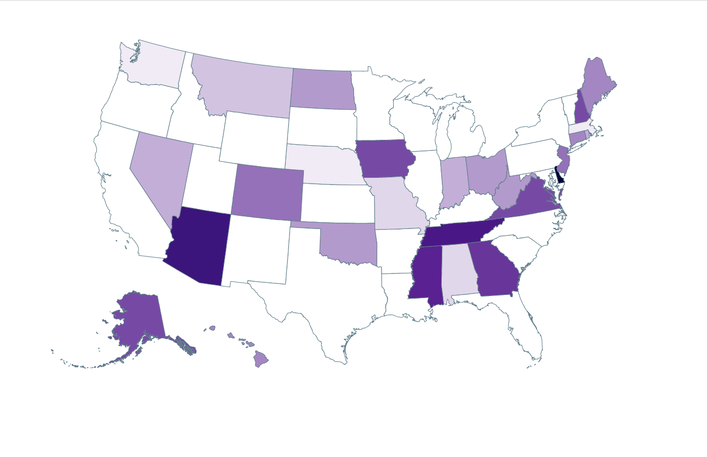

# dd alberts project

visualize dd logs-queries with Albers USA D3 projections

## setup [wip]

- clone repository
- add your Datadog `API_KEY` and `APP_KEY` to the `.env` file in this repository. DatadogHQ is a monitoring platform that's free to sign up for at `https://www.datadoghq.com/`. (if using heroku add env variables to settings)
- enable Logs in datadog [datadog logs](https://docs.datadoghq.com/logs/log_collection/?tab=tailexistingfiles)
- create a [facet](https://docs.datadoghq.com/logs/explorer/?tab=facets#setup) for state_name (example `state_name:Alabama`)
- create a [measure](https://docs.datadoghq.com/logs/explorer/?tab=measures#setup) for the value you wish to visualize (default `revenue`) 
- `npm install`
- `npm start`
- make gist of your `/logs-queries/` request and copy the link (from: https://docs.datadoghq.com/api/?lang=bash#get-a-list-of-logs ) [example gist](https://gist.githubusercontent.com/ericmustin/3550658e5a2c8abe49bbe334e9c662ba/raw/7f0539d1f723e6758dc2d270973416e1813673c1/log_query.json)
- visit in browser with query param "config" set to url of `/log-queries/` post body json

## example usage

```
dd_albers_project $ npm start
visit localhost:5000/?config=<gist_of_logs_queries_post_body.json>

```

### example gif output



### NOTES
- This is WIP, still only supports log searches that return a facet "state_name" and measure "revenue" at the moment as POC